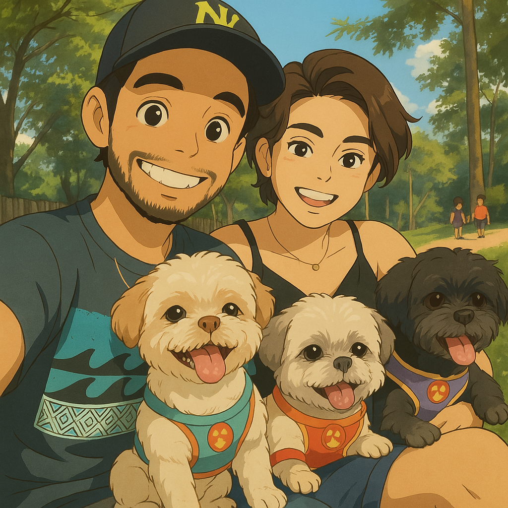

# mae  
**Homenagem Interativa de Dia das Mães – “Sempre ao Seu Lado, Mãe”**

[](https://mae-swart.vercel.app)  
[]() 
[]() 
[]()

Uma página feita com amor como surpresa especial para o Dia das Mães — unindo emoção, interatividade, patinhas e corações. Esta homenagem celebra a mãe da família com uma experiência única, vinda de Estrela, Toddy, Simba, Léo (e o papai, claro).

## Demonstração  
Acesse: [mae-swart.vercel.app](https://mae-swart.vercel.app/)


> *"Sempre ao seu lado, mãe"* não é apenas uma frase. É a vida que vivemos juntos, todos os dias.

---

## Funcionalidades

- Tela inicial com transição suave  
- Música ambiente com controle  
- Animação de corações e estrelas  
- Carta com efeito de digitação  
- Lista animada de motivos de amor  
- Galeria com fotos e mensagens dos pets  
- Assinatura dinâmica ao final  
- Layout 100% responsivo  

---

## Estrutura do Projeto

```
homenagem-dia-das-maes/
├── index.html
├── assets/
│   ├── css/
│   │   └── style.css
│   ├── js/
│   │   ├── script.js
│   │   └── background-stars.js
│   ├── img/
│   │   ├── background.jpg
│   │   ├── estrela.jpg
│   │   ├── toddy.jpg
│   │   ├── leo.jpg
│   │   └── simba.jpg
│   └── music/
│       └── music.mp3
└── README.md
```

---

## Tecnologias Utilizadas

- **HTML5**  
- **CSS3** (com animações personalizadas)  
- **JavaScript Puro** (manipulação do DOM, animações, controle de áudio)

---

## Como Executar

```bash
git clone https://github.com/seu-usuario/homenagem-dia-das-maes.git
cd homenagem-dia-das-maes
# Abra o index.html no navegador
```

> *Dica:* Use fones de ouvido para imersão completa.

---

## Personalização

Você pode modificar facilmente:

- Fotos e nomes dos pets  
- Conteúdo da carta  
- Lista de motivos no array `reasons[]`  
- Música e imagem de fundo  
- Cores e estilos no CSS

---

## Créditos

Criado por **Davidson Dias** com muito carinho como presente para sua esposa — a melhor mãe de quatro patas que seus filhos poderiam ter.

> *“Te amamos mais do que ração (e olha que isso é muito, hein!)”*  
> – Estrela, Toddy, Simba, Léo e Papai

---

# English Version  
**Interactive Mother's Day Tribute – “Always by Your Side, Mom”**

A lovingly crafted page, created as a heartfelt surprise for Mother’s Day — blending emotion, interactivity, pawprints, and hearts. This tribute celebrates the heart of the family with a unique experience from Estrela, Toddy, Simba, Léo (and dad, of course).

## Live Demo  
[Visit the Site](https://mae-swart.vercel.app/)

> *“Always by your side, mom”* is more than a phrase — it’s the life we live every day.

---

## Features

- Smooth welcome screen transition  
- Background music with audio controls  
- Real-time animated floating hearts  
- Auto-typed heartfelt letter  
- Animated list of love reasons  
- Pet photo/message section  
- Final dynamic signature  
- Background stars animation  
- Fully responsive layout  

---

## Project Structure

```
mother-day-tribute/
├── index.html
├── assets/
│   ├── css/
│   │   └── style.css
│   ├── js/
│   │   ├── script.js
│   │   └── background-stars.js
│   ├── img/
│   │   ├── background.jpg
│   │   ├── estrela.jpg
│   │   ├── toddy.jpg
│   │   ├── leo.jpg
│   │   └── simba.jpg
│   └── music/
│       └── music.mp3
└── README.md
```

---

## Technologies Used

- **HTML5**  
- **CSS3** (with custom animations)  
- **Vanilla JavaScript** (DOM manipulation, animations, audio control)

---

## How to Run

1. Download or clone this repository  
2. Keep the folder structure as shown above  
3. Open `index.html` in your browser  
4. Click **"Enter"** to start the tribute  

> *Tip:* For the best experience, use headphones or external speakers.

---

## Customization

You can personalize the tribute by:

- Replacing pet names/photos in the section  
- Editing the letter text in `script.js`  
- Updating the reasons in the `reasons[]` array  
- Changing the background image or music  
- Adjusting styles and colors in `style.css`

---

## Credits

Created by **Davidson Dias** with love as a gift for his wife — the best mom their four-legged children could ever have.

> *"We love you more than kibble — and that’s saying a lot!"*  
> – Estrela, Toddy, Simba, Léo & Dad
